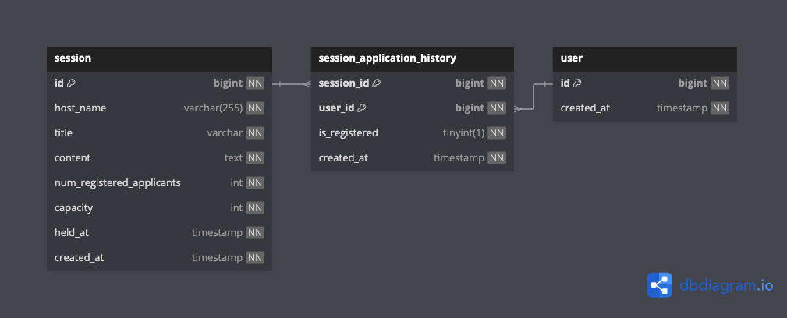

# TDD와 클린 아키텍처로 구현한 선착순 특강 신청 서비스

### ERD 및 SQL 스크립트(MySQL InnoDB) - STEP03



```sql
# version: step03
CREATE TABLE `session` (
  `id` bigint PRIMARY KEY NOT NULL AUTO_INCREMENT,
  `host_name` varchar(255) NOT NULL,
  `title` varchar(255) NOT NULL,
  `content` text NOT NULL,
  `num_registered_applicants` int NOT NULL,
  `capacity` int NOT NULL,
  `held_at` timestamp NOT NULL,
  `created_at` timestamp NOT NULL
  INDEX `idx_session_created_at` (`created_at` DESC)
) ENGINE=InnoDB;

CREATE TABLE `session_application_history` (
  `session_id` bigint NOT NULL,
  `user_id` bigint NOT NULL,
  `is_registered` tinyint(1) NOT NULL,
  `created_at` timestamp NOT NULL,
  PRIMARY KEY (`session_id`, `user_id`),
  FOREIGN KEY (`user_id`) REFERENCES `user` (`id`),
  FOREIGN KEY (`session_id`) REFERENCES `session` (`id`),
  INDEX `idx_session_application_history_session_id` (`session_id`),
  INDEX `idx_session_application_history_user_id` (`user_id`),
  INDEX `idx_session_application_history_created_at` (`created_at` DESC)
) ENGINE=InnoDB;

CREATE TABLE `user` (
  `id` bigint PRIMARY KEY NOT NULL AUTO_INCREMENT,
  `created_at` timestamp NOT NULL
) ENGINE=InnoDB;
```